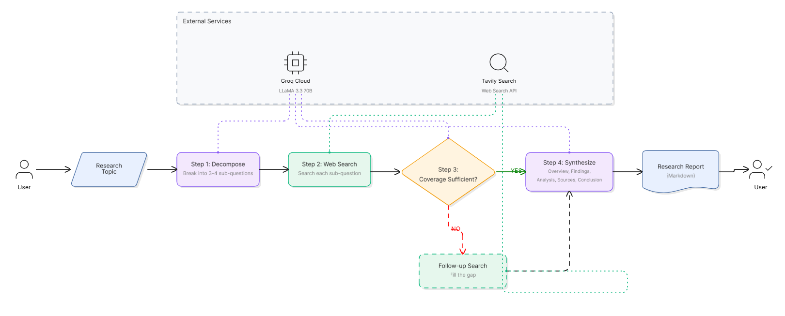

# 🔍 Research Assistant Agent

An AI-powered research agent that autonomously investigates any topic by decomposing it into sub-questions, searching the web for real-time information, evaluating coverage quality, and synthesizing a structured markdown report — all through a clean Streamlit interface.

**Powered by:** LLaMA 3.3 70B (via Groq) · Tavily Search API · LangChain · Streamlit

---

## 📸 Architecture



The agent follows a **4-step sequential pipeline** with a critical decision-making checkpoint at Step 3. Each step reads from and writes to a shared `AgentState`, ensuring data flows cleanly through the entire chain.

### Pipeline Walkthrough

| Step | Name | What Happens |
|------|------|-------------|
| **Step 1** | Decompose Question | The LLM analyzes the user's topic and breaks it into 3–4 focused sub-questions for targeted research |
| **Step 2** | Web Search | Each sub-question is searched on the web via the Tavily API (3 results per query), and results are collected |
| **Step 3** | Evaluate Coverage ★ | **Decision Point** — The LLM reviews all gathered results and decides: is the information sufficient? If **NO**, it generates a follow-up query and runs one additional search automatically |
| **Step 4** | Synthesize Report | The LLM takes all collected data (including any follow-up results) and produces a structured markdown report |

### The Decision-Making Step (Step 3)

This is the **key agentic behavior** in the pipeline. Rather than blindly proceeding from search to synthesis, the agent pauses to evaluate what it has:

1. All search results gathered so far are sent to the LLM
2. The LLM returns a structured JSON decision:
   ```json
   {
     "sufficient": true/false,
     "reason": "explanation of the decision",
     "followup_query": "specific query to fill the gap, or null"
   }
   ```
3. **If sufficient = true** → The agent proceeds directly to report synthesis
4. **If sufficient = false** → The agent autonomously runs a follow-up web search using the LLM-generated query, adds those results to the state, then proceeds to synthesis

This creates a **conditional branching behavior** where the agent's next action depends entirely on its evaluation of previous results — a core characteristic of agentic systems.

---

## 🏗️ Design Choices & Architecture Decisions

### Why Plain Sequential Python (No LangGraph)?

LangGraph is powerful for complex cyclic agent workflows, but it adds unnecessary abstraction for a linear pipeline with a single decision branch. By using plain Python functions that pass a shared `AgentState` dictionary, the code is:
- **Transparent** — every step is a simple function: `state in → state out`
- **Debuggable** — you can inspect the state between any two steps
- **Lightweight** — no framework overhead, no graph compilation

### Why TypedDict for State Management?

`TypedDict` gives us type safety and IDE autocompletion without the overhead of Pydantic models or dataclasses. Since the state is only passed between 4 sequential functions (not serialized or stored), a typed dictionary is the simplest correct choice.

```python
class AgentState(TypedDict):
    topic: str
    sub_questions: list[str]
    search_results: dict[str, str]
    coverage_sufficient: bool
    followup_query: str | None
    report: str
```

### Why Separate Prompts File?

All three system prompts live in `prompts.py`, completely separated from the agent logic. This makes it easy to:
- Iterate on prompt wording without touching logic code
- Review all prompts in one place
- Swap or A/B test different prompt strategies

### Why Groq + LLaMA 3.3 70B?

- **Groq** provides extremely fast inference (tokens/sec) on open-source models, making the multi-step agent feel responsive
- **LLaMA 3.3 70B Versatile** offers strong reasoning capabilities needed for question decomposition, coverage evaluation (JSON output), and report synthesis
- **Free tier** means zero cost for development and demonstration

### Why Tavily Search?

Tavily is purpose-built for AI agents — it returns clean, structured results (title, content, URL) rather than raw HTML. This means:
- No scraping or HTML parsing needed
- Results are immediately usable as LLM context
- It integrates natively with LangChain's tool ecosystem

### Why Individual Step Calls in the UI?

In `app.py`, each step function is called individually (not through `run_research_agent()`) so that each step can be wrapped in its own `st.status()` block. This gives the user **real-time progress visibility** — they see each step start, execute, and complete, rather than waiting for a single black-box operation.

---

## 📁 Project Structure

```
research_agent/
├── app.py             # Streamlit UI — calls each step individually with progress display
├── agent.py           # Core agent logic — 4 step functions + orchestrator
├── prompts.py         # All LLM prompts (decomposer, decision, synthesizer)
├── requirements.txt   # Python dependencies
├── .env               # API keys (GROQ_API_KEY, TAVILY_API_KEY)
└── README.md          # This file
```

### File Responsibilities

| File | Purpose |
|------|---------|
| `agent.py` | Contains the `AgentState` type, all 4 step functions (`decompose_question`, `search_web`, `decision_checkpoint`, `synthesize_report`), and the `run_research_agent()` orchestrator |
| `app.py` | Streamlit UI that validates API keys, takes user input, runs each step with visual progress indicators, and displays the final report with a download button |
| `prompts.py` | Three prompt templates (`DECOMPOSER_PROMPT`, `DECISION_PROMPT`, `SYNTHESIZER_PROMPT`) using Python `.format()` for variable injection |
| `.env` | Environment variables for API keys — loaded by `python-dotenv` |

---

## 🚀 Getting Started

### Prerequisites

- Python 3.10 or higher
- A [Groq API key](https://console.groq.com/keys) (free tier available)
- A [Tavily API key](https://app.tavily.com/) (free tier available)

### Installation

1. **Clone or navigate to the project directory:**
   ```bash
   cd research_agent
   ```

2. **Install dependencies:**
   ```bash
   pip install -r requirements.txt
   ```

3. **Configure API keys** — create/edit the `.env` file:
   ```env
   GROQ_API_KEY=your_groq_api_key_here
   TAVILY_API_KEY=your_tavily_api_key_here
   ```

4. **Run the application:**
   ```bash
   streamlit run app.py
   ```

5. **Open in browser** — Streamlit will display a local URL (typically `http://localhost:8501`)

### Usage

1. Enter a research topic (e.g., *"Impact of AI on software engineering jobs in 2025"*)
2. Click **"Start Research"**
3. Watch the 4 steps execute with real-time progress
4. Read the generated report
5. Optionally download the report as a `.md` file

---

## 🛠️ Tech Stack

| Component | Technology | Purpose |
|-----------|-----------|---------|
| LLM | LLaMA 3.3 70B Versatile | Question decomposition, coverage evaluation, report synthesis |
| LLM Provider | Groq Cloud | Fast inference with free tier |
| Web Search | Tavily Search API | Real-time web search with structured results |
| Framework | LangChain | LLM abstraction and tool integration |
| UI | Streamlit | Interactive web interface with progress indicators |
| Config | python-dotenv | Secure API key management via `.env` files |

---

## 📊 Results

Sample research runs with screenshots are available in the [`/results`](./results/) 
folder, demonstrating both execution paths — standard synthesis and 
follow-up search triggered by the coverage evaluation step.
